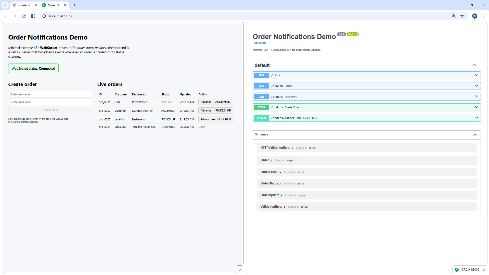

# Order Notifications Demo

Minimal full-stack example of **real-time order status updates** using:

- **FastAPI** + **WebSockets** on the backend  
- **React + TypeScript + Vite** on the frontend

Whenever an order is created or its status changes, the backend broadcasts an event over a WebSocket channel and the UI updates instantly without a manual refresh.



---

## Features

- **Create orders** from the UI (`customer_name`, `restaurant_name`)
- **In-memory order store** with a simple set of statuses:
  - `PENDING`, `ACCEPTED`, `PICKED_UP`, `DELIVERED`, `CANCELLED`
- **WebSocket-powered live updates**
  - frontend subscribes to `ws://localhost:8000/ws/orders`
  - receives an initial snapshot plus subsequent events
- **REST API** for creating and updating orders
- **CORS configured** for local dev (`http://localhost:5173`)
- Clear, portfolio-ready structure with separate `backend/` and `frontend/` folders

---

## Tech stack

**Backend**

- Python 3.11+
- FastAPI
- WebSockets (via Starlette / FastAPI)
- Pydantic models
- Uvicorn

**Frontend**

- React 18
- TypeScript
- Vite
- Minimal custom CSS

---

## Project structure

```text
order-notifications-demo/
├── backend/
│   ├── app/
│   │   ├── __init__.py
│   │   ├── main.py        # FastAPI app + WebSocket endpoint
│   │   └── models.py      # Pydantic models, in-memory store, enum
│   ├── requirements.txt
│   └── README.md          # (optional, backend-specific)
├── frontend/
│   ├── public/
│   ├── src/
│   │   ├── assets/
│   │   ├── components/
│   │   │   └── OrdersView.tsx  # Main UI: form + live orders table
│   │   ├── App.tsx
│   │   ├── App.css
│   │   ├── index.css
│   │   └── main.tsx
│   ├── package.json
│   ├── tsconfig*.json
│   └── vite.config.ts
├── doc/order_notification.png   # UI screenshot used in this README
└── README.md                # (this file)
```

---

## Running the project locally

### 1. Backend (FastAPI + WebSocket)

From the project root:

```bash
cd backend

# (Optional) create a virtual environment
python -m venv .venv
# Windows
.venv\Scripts\activate
# macOS / Linux
# source .venv/bin/activate

pip install -r requirements.txt

uvicorn app.main:app --reload
```

The backend will be available at:

* REST API: `http://127.0.0.1:8000`
* Docs: `http://127.0.0.1:8000/docs`
* WebSocket endpoint: `ws://127.0.0.1:8000/ws/orders`

---

### 2. Frontend (React + Vite)

In a **new terminal** from the project root:

```bash
cd frontend
npm install
npm run dev
```

Vite will start the dev server on `http://localhost:5173` (or the next free port).

Open that URL in your browser to see the live UI.

---

## How the real-time flow works

1. **Frontend connects to WebSocket**

   `OrdersView.tsx` opens a WebSocket to:

   ```text
   ws://localhost:8000/ws/orders
   ```

2. **Initial snapshot**

   When a client connects, the backend sends:

   ```json
   {
     "type": "snapshot",
     "orders": [ /* full list of current orders */ ]
   }
   ```

3. **Order created**

   When you create a new order (via UI or API), the backend:

   * stores it in an in-memory `order_store`
   * broadcasts an event:

   ```json
   {
     "type": "order_created",
     "order": {
       "id": "ord_0001",
       "customer_name": "Alice",
       "restaurant_name": "Pizza Palace",
       "status": "PENDING",
       "created_at": "2025-12-06T02:06:58.961381",
       "updated_at": "2025-12-06T02:06:58.961381"
     }
   }
   ```

4. **Order updated**

   When an order’s status changes (`PATCH /orders/{order_id}`), the backend broadcasts:

   ```json
   {
     "type": "order_updated",
     "order": {
       "id": "ord_0001",
       "status": "DELIVERED",
       ...
     }
   }
   ```

5. **Frontend state sync**

   The UI listens for `snapshot`, `order_created`, and `order_updated` events and keeps its local state in sync, updating the table instantly.

---

## API summary

### List orders

```http
GET /orders
```

Response:

```json
[
  {
    "id": "ord_0001",
    "customer_name": "Alice",
    "restaurant_name": "Pizza Palace",
    "status": "PENDING",
    "created_at": "...",
    "updated_at": "..."
  }
]
```

### Create order

```http
POST /orders
Content-Type: application/json
```

Body:

```json
{
  "customer_name": "Alice",
  "restaurant_name": "Pizza Palace"
}
```

### Update order status

```http
PATCH /orders/{order_id}
Content-Type: application/json
```

Body:

```json
{
  "status": "DELIVERED"
}
```

Allowed values for `status`:

* `PENDING`
* `ACCEPTED`
* `PICKED_UP`
* `DELIVERED`
* `CANCELLED`

If an invalid status is sent, FastAPI returns a 422 validation error.

---

## Design notes & possible extensions

This project is intentionally small but structured like a real service:

* **Separation of concerns**: transport (FastAPI/WebSocket) vs. domain models (`Order`, `OrderStatus`, `order_store`).
* **Typed models**: Pydantic models validate and serialize everything going over the wire.
* **Connection manager**: central place to track WebSocket clients and broadcast events.

Ideas for future improvements:

* Persist orders to a real database (PostgreSQL, Redis, etc.)
* Add authentication and per-user streams
* Add server-sent events (SSE) version of the stream
* Add tests for the in-memory store and WebSocket event flow
* Deploy backend and frontend together with Docker
